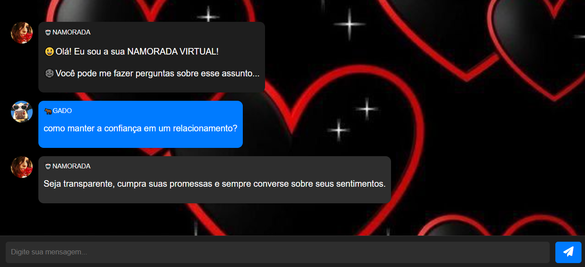

# NAMORADA VIRTUAL
👨‍🏫CHATBOT DE PAPO SIMPLES SOBRE NAMORO.

  

## DESCRIÇÃO:
A **NAMORADA VIRTUAL** é um assistente virtual interativo, criado para simular uma conversa divertida sobre temas variados, com foco principal em namoro e relacionamentos. Ele permite que o usuário faça perguntas, receba respostas instantâneas, e participe de uma interação simulada. O bot responde de maneira personalizada e utiliza uma interface simples e intuitiva, proporcionando uma experiência leve e agradável.

## FUNCIONALIDADES:
- **Interação via chat**: O bot responde perguntas com base em um conjunto de frases predefinidas (SAUDAÇÕES, perguntas sobre **NAMORO**, e respostas padrões).
- **Resposta personalizada**: O bot consegue reconhecer palavras-chave e fornecer respostas que se alinham com o tema solicitado.
- **Indicador de digitação**: Um recurso visual que mostra o "robô" digitando antes de responder, proporcionando uma experiência mais realista.
- **Suporte para envio por botão e tecla "Enter"**: O usuário pode enviar suas mensagens clicando no botão ou pressionando a tecla Enter.
- **Rolagem automática**: O chat se ajusta automaticamente para exibir as mensagens mais recentes.

## EXECUTANDO O PROJETO:
1. **Inicialização**: Abra o arquivo `./CODIGO/index.html` no navegador de sua preferencia.
2. **Digite sua pergunta**: No campo de entrada de texto, você pode escrever qualquer pergunta ou frase relacionada ao tema de namoro.
3. **Envie a mensagem**: Após digitar, pressione o botão de envio (ícone de avião de papel) ou aperte Enter para enviar a mensagem.
4. **Aguarde a resposta**: O bot exibe um indicador de digitação para simular que ele está pensando antes de responder, e então ele dará a resposta relacionada ao tema solicitado.
5. **Continue a interação**: A cada nova pergunta, o bot responderá com base nas suas palavras, buscando proporcionar uma conversa contínua.

## NÃO SABE?
- Entendemos que para manipular arquivos em `HTML`, `CSS` e outras linguagens relacionadas, é necessário possuir conhecimento nessas áreas. Para auxiliar nesse aprendizado, oferecemos cursos gratuitos disponíveis:
* [CURSO DE HTML E CSS](https://github.com/VILHALVA/CURSO-DE-HTML-E-CSS)
* [CURSO DE JAVASCRIPT](https://github.com/VILHALVA/CURSO-DE-JAVASCRIPT)
* [CURSO DE JQUERY](https://github.com/VILHALVA/CURSO-DE-JQUERY)
* [CONFIRA MAIS CURSOS](https://github.com/VILHALVA?tab=repositories&q=+topic:CURSO)

## CREDITOS:
- [PROJETO BASEADO NO "CONVERSADOR NA WEB"](https://github.com/VILHALVA/CONVERSADOR-NA-WEB)
- [PROJETO FEITO PELO VILHALVA](https://github.com/VILHALVA)